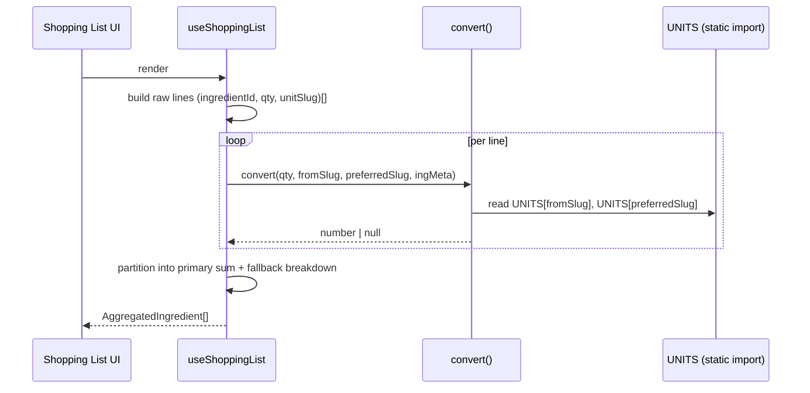

## 2. Problem Statement

Recipes mix unit systems — `200 g` flour in one recipe, `2 CàS` in another, `3 eggs` in a third. The app needs:

- `[G-1]` A closed, typed catalog of units (hardcoded `UNITS` constant + `UnitSlug` string-union type), reviewed
  in code and identical across devices.
- `[G-2]` A way to express unit relationships via `parent` + `factor` (e.g., `1 kg = 1000 × g`).
- `[G-3]` Unitless ingredients ("1 egg", "à goût") remain representable — unit is optional on
  `group_ingredients` (`unit_slug` is nullable).
- `[G-4]` Dimension classification (`mass` | `volume` | `count`) so the conversion engine knows which
  conversions are universal (same-dimension) and which need ingredient metadata (cross-dimension).
- `[G-5]` A pure conversion function `convert(quantity, fromSlug, toSlug, ingredient)` that returns a number
  when the conversion is well-defined and `null` when it is not.
- `[G-6]` Cross-dimension bridging using ingredient-specific metadata: `density_g_per_ml` bridges mass ↔
  volume; `count_weight_g` bridges count ↔ mass; volume ↔ count chains through mass.
- `[G-7]` Never throw on missing data. Callers (primarily the shopping list) present a graceful fallback when
  conversion is impossible.

## 3. Key Design Decisions

| Decision                                   | Choice                                                                                          | Rationale                                                                                                                                |
| ------------------------------------------ | ----------------------------------------------------------------------------------------------- | ---------------------------------------------------------------------------------------------------------------------------------------- |
| `[KD-1]` Hardcoded catalog                 | `UNITS` constant in `src/lib/db/schema/unit.ts` + `UnitSlug` string-union type                  | Units are a closed, slow-changing vocabulary. Compile-time data removes CRUD, admin auth, and runtime roundtrips.                        |
| `[KD-2]` Slug-based identity               | `UnitSlug = 'g' \| 'kg' \| 'ml' \| 'l' \| 'cas' \| 'cac' \| 'piece' \| 'pincee'`                | String slugs persist stably in `group_ingredients.unit_slug TEXT`; renames become explicit migrations rather than numeric-ID reshuffles. |
| `[KD-3]` Hierarchical with factor          | Each unit declares `parent: UnitSlug \| null` + `factor: number \| null`                        | `factor` = "how many parent units per this unit". Non-base units MUST declare both.                                                      |
| `[KD-4]` Dimension-classified              | `dimension: 'mass' \| 'volume' \| 'count'`                                                      | Same-dimension conversion is universal (factor chain); cross-dimension requires ingredient metadata.                                     |
| `[KD-5]` One base per dimension            | Exactly one unit per dimension has `parent: null` — `g`, `ml`, `piece`                          | Conversion walks `parent` toward the base; a second disconnected base would not be reachable.                                            |
| `[KD-6]` No DB table, no FK                | `group_ingredients.unit_slug TEXT NULL` with NO FK; `ingredient.preferred_unit_slug` same shape | Removes admin UI, `authGuard('admin')`, delete-cascade semantics, and orphan-row concerns. The literal union IS the catalog.             |
| `[KD-7]` Optional on ingredient lines      | `unit_slug` remains nullable                                                                    | Unitless ingredients ("1 egg", "à goût") stay representable; nothing breaks when a line has no unit.                                     |
| `[KD-8]` Two-step conversion algorithm     | `fromSlug → base(fromDimension)` → `base(toDimension) → toSlug`; ingredient bridges dimensions  | Separates "within dimension" (pure unit math) from "across dimension" (needs ingredient metadata).                                       |
| `[KD-9]` Return `null`, don't throw        | Missing density / count weight / invalid slug / broken chain → `null`                           | Callers choose how to present failure. Throwing would force try/catch around pure math.                                                  |
| `[KD-10]` Pure, no I/O                     | Catalog is a compile-time import; ingredient metadata is a function argument                    | Deterministic, fast, trivial to test. No `UnitCatalog` parameter — the catalog is already in scope everywhere.                           |
| `[KD-11]` Slug-typed inputs to `convert`   | Signature takes `UnitSlug` values, not resolved `Unit` records                                  | Callers read slugs straight from the DB / store and pass them through. Internal lookup via `UNITS[slug]` is trivial.                     |
| `[KD-12]` Drizzle `$type<UnitSlug>()`      | `unit_slug: text('unit_slug').$type<UnitSlug>()` — typed in TS, plain `TEXT` in SQLite          | SQLite does not enforce CHECK constraints against a literal union. Validity lives at the write boundary via `unitSlugSchema` (Zod).      |
| `[KD-13]` Validation at the write boundary | Zod `unitSlugSchema` gates every mutation that writes `unit_slug` or `preferred_unit_slug`      | A single runtime type-guard helper (`isUnitSlug`) would duplicate `unitSlugSchema` — Zod already performs the check and surfaces errors. |

## 4. Principles & Intents

- `[PI-1]` **Catalog is compile-time data** — the TypeScript literal union `UnitSlug` is the source of truth.
  Writes carrying an unknown slug are rejected at the Zod boundary, not at the DB.
- `[PI-2]` **Nullable unit on ingredient lines is load-bearing** — UI and conversion logic must handle
  `unit_slug === null` without throwing.
- `[PI-3]` **Parent and child share a dimension** — enforced structurally in the catalog file. A runtime check
  in the conversion engine still returns `null` on violation as defense in depth.
- `[PI-4]` **One base unit per dimension** — `g`, `ml`, `piece`. The conversion engine relies on this invariant.
- `[PI-5]` **Renames are migrations** — renaming a slug ("cas" → "tbsp") requires a DB backfill on
  `group_ingredients.unit_slug` and `ingredient.preferred_unit_slug` plus the catalog edit. Treat slug strings
  as forever-stable.
- `[PI-6]` **`convert` is pure** — same arguments ⇒ same result, always. No hidden state, no side effects.
- `[PI-7]` **Minimal surface** — one main export (`convert`) plus a small set of typed helpers. No class, no
  builder, no fluent API.
- `[PI-8]` **No silent rounding** — `convert` returns a `number` as-is; callers decide on display rounding.
- `[PI-9]` **Unit chain walks are bounded** — the factor chain is walked iteratively with a hard cap (16
  levels) so a malformed cycle returns `null` instead of hanging.
- `[PI-10]` **Trivial case never fails** — `convert(q, s, s, _) === q` for any `s` in `UNITS`, even if the
  ingredient has no metadata.
- `[PI-11]` **Unknown slugs are data errors** — a slug not in `UNITS` returns `null` from `convert`. No fuzzy
  matching, no fallback to a sibling unit.

## 5. Non-Goals

- `[NG-1]` Runtime unit creation — no admin UI, no API, no settings page. Adding a unit is a code change.
- `[NG-2]` Locale-aware unit names (imperial / metric toggle). The `name` field is the single display label.
- `[NG-3]` Unit aliases / synonyms (`g` vs `gram` vs `grams`). One canonical slug per unit.
- `[NG-4]` Per-ingredient-category validation against units (e.g., forbidding `ml` on a solid). The conversion
  engine handles cross-dimension failure gracefully instead.
- `[NG-5]` In-place conversion of recipe display at read time. Conversion is a shopping-list concern; the
  recipe always shows the unit as entered.
- `[NG-6]` Per-ingredient-per-unit override table (`ingredient_unit_overrides`). Density + count weight is
  deliberately the only per-ingredient knob.
- `[NG-7]` State-dependent density (packed/sifted, melted/solid). See `ingredients.spec.md` `[NG-5]`.
- `[NG-8]` Temperature- or humidity-aware conversion. Groceries, not chemistry.
- `[NG-9]` Conversion of compound expressions ("2 cups + 1 tbsp"). Input is always a single `(quantity, slug)`.
- `[NG-10]` Rounding to "shopping-friendly" values (e.g., nearest 50 g). Callers do this if they want.

## 6. Caveats

- `[C-1]` Adding, renaming, or removing a slug requires a deploy AND, in the rename/remove case, a data
  migration on `group_ingredients.unit_slug` and `ingredient.preferred_unit_slug`. Plan renames alongside
  schema migrations.
- `[C-2]` Removing a slug from the catalog without a backfill leaves orphan values in existing rows. The UI
  treats any slug not present in `UNITS` as unitless (same visual as `null`) and `convert` returns `null` for
  that slug, so the app does not crash — but those lines lose their unit until a migration runs.
- `[C-3]` `factor <= 0` on a non-base unit is nonsensical for conversion and will cause the conversion engine
  to return `null`. This is reviewable at code-review time; no runtime validation beyond the engine's defensive
  null-return.
- `[C-4]` `name` (display label) is not uniqueness-enforced. Two units can share a display name if a reviewer
  misses it; `slug` uniqueness is enforced by the TypeScript object literal.
- `[C-5]` Volume ↔ count conversion requires both `density_g_per_ml` AND `count_weight_g` (bridge through
  mass). Either missing ⇒ `null`.
- `[C-6]` `density_g_per_ml` is a scalar approximation. Real-world density varies with packing, temperature,
  etc. — see `ingredients.spec.md` `[PI-5]`. One value per ingredient.
- `[C-7]` Float accumulation drift: callers summing many converted values should be aware that intermediate
  results are `number`s. Acceptable for grocery quantities; not for lab precision.

## 7. High-Level Components

```
┌────────────────────┐
│  UI (forms, cart)  │
└─────────┬──────────┘
          │ reads UNITS, uses <UnitPicker>, <UnitLabel>
          ▼
┌────────────────────┐       ┌────────────────────┐
│ db/schema/unit.ts  │──────▶│ unit-converter.ts  │
│ UNITS, UnitSlug,   │       │ convert(), base()  │
│ Unit, getUnit      │       └─────────┬──────────┘
└────────────────────┘                 │
                                       ▼
                                 number | null
```

| Component         | Module type     | Responsibility                                                           | Public API surface                                                      |
| ----------------- | --------------- | ------------------------------------------------------------------------ | ----------------------------------------------------------------------- |
| Catalog           | Static TS data  | Single source of truth for units                                         | `UNITS`, `UnitSlug`, `Unit`, `Dimension`, `getUnit(slug)`               |
| Slug Zod schema   | Shared          | Validate `unit_slug` at API boundaries                                   | `unitSlugSchema` (Zod native enum built from `UNITS` keys)              |
| `convert`         | Pure TS lib     | Convert `quantity` from `fromSlug` to `toSlug` using ingredient metadata | `convert(quantity, fromSlug, toSlug, ingredient): number \| null`       |
| `toCanonicalBase` | Pure TS lib     | Convert to the canonical base unit of a dimension                        | `toCanonicalBase(quantity, slug): { value: number; dimension } \| null` |
| Unit picker       | React component | Selectable list of units, grouped by dimension                           | `<UnitPicker value slug onChange />`                                    |
| Unit label        | React component | Render a slug as its display name; unknown or null → unitless            | `<UnitLabel slug={...} />`                                              |

## 8. Detailed Design

### Catalog (`src/lib/db/schema/unit.ts`)

```typescript
export type Dimension = 'mass' | 'volume' | 'count'

export type UnitSlug =
  | 'g'
  | 'kg'
  | 'ml'
  | 'l'
  | 'cas' // cuillère à soupe
  | 'cac' // cuillère à café
  | 'piece'
  | 'pincee'

export type Unit = {
  readonly slug: UnitSlug
  readonly name: string
  readonly dimension: Dimension
  readonly parent: UnitSlug | null
  readonly factor: number | null
}

export const UNITS = {
  g: { slug: 'g', name: 'g', dimension: 'mass', parent: null, factor: null },
  kg: { slug: 'kg', name: 'kg', dimension: 'mass', parent: 'g', factor: 1000 },
  ml: { slug: 'ml', name: 'ml', dimension: 'volume', parent: null, factor: null },
  l: { slug: 'l', name: 'L', dimension: 'volume', parent: 'ml', factor: 1000 },
  cas: { slug: 'cas', name: 'CàS', dimension: 'volume', parent: 'ml', factor: 15 },
  cac: { slug: 'cac', name: 'CàC', dimension: 'volume', parent: 'ml', factor: 5 },
  piece: { slug: 'piece', name: 'pièce', dimension: 'count', parent: null, factor: null },
  pincee: { slug: 'pincee', name: 'pincée', dimension: 'count', parent: null, factor: null },
} as const satisfies Record<UnitSlug, Unit>

export function getUnit(slug: UnitSlug): Unit {
  return UNITS[slug]
}
```

### Schema (`src/lib/db/schema/recipe-ingredients.ts`)

```typescript
unitSlug: text('unit_slug').$type<UnitSlug>(), // TEXT at the DB level; typed as UnitSlug in TS. No CHECK, no FK.
```

Drizzle's `$type<UnitSlug>()` narrows the column type in TypeScript to `UnitSlug | null` but emits plain
`TEXT` in SQLite — consistent with SQLite's flexible typing and `[KD-12]` below. Validity is enforced at
write time by `unitSlugSchema` at the API boundary.

### Zod schema (at the write boundary, e.g. next to the catalog)

```typescript
import { z } from 'zod'
import { UNITS, type UnitSlug } from '@/lib/db/schema/unit'

export const unitSlugSchema = z.enum(Object.keys(UNITS) as [UnitSlug, ...UnitSlug[]])
```

### Conversion API (`src/utils/unit-converter.ts`)

```typescript
export type IngredientConversionMeta = {
  readonly densityGPerMl: number | null
  readonly countWeightG: number | null
}

/**
 * Convert `quantity` from `fromSlug` to `toSlug`, using ingredient metadata to
 * bridge dimensions (mass ↔ volume via density, count ↔ mass via count weight,
 * volume ↔ count through mass).
 *
 * Returns the converted numeric quantity, or `null` when the conversion is
 * not well-defined (unknown slug, missing metadata, broken factor chain).
 *
 * Invariants:
 *   - convert(q, s, s, _) === q for any s in UNITS (no metadata needed).
 *   - Pure: same inputs ⇒ same result.
 *   - Never throws.
 */
export function convert(quantity: number, fromSlug: UnitSlug, toSlug: UnitSlug, ingredient: IngredientConversionMeta): number | null

/**
 * Reduce `(quantity, slug)` to its canonical base in the unit's own dimension.
 * Walks `parent` / `factor` via UNITS with a cap of 16 iterations. Returns
 * `null` on broken chains (missing parent, missing factor, factor <= 0,
 * cycle, depth exceeded).
 */
export function toCanonicalBase(quantity: number, slug: UnitSlug): { value: number; dimension: Dimension } | null
```

### Algorithm

Given `from = UNITS[fromSlug]`, `to = UNITS[toSlug]`:

1. **Trivial case.** If `fromSlug === toSlug`, return `quantity`.
2. **Canonicalize.** Compute `a = toCanonicalBase(quantity, fromSlug)`. Bail out with `null` on failure.
3. **Bridge dimensions** (if `from.dimension !== to.dimension`). Use the ingredient's metadata:
   - **mass ↔ volume**: requires `densityGPerMl`. `g_to_ml = g / density`; `ml_to_g = ml * density`.
   - **mass ↔ count**: requires `countWeightG`. `g_to_piece = g / countWeightG`; `piece_to_g = piece * countWeightG`.
   - **volume ↔ count**: chain through mass — requires BOTH `densityGPerMl` and `countWeightG`.
   - Any required metadatum is `null` or `<= 0` ⇒ return `null`.
4. **Denormalize.** Walk the factor chain from `base(to.dimension)` down to `toSlug` (inverse of step 2):
   divide by each child-to-parent factor. Same 16-level cap, same `null` bailout.
5. Return the resulting `number`.

Factor chain semantics (per `[KD-3]`): a unit `U` with `parent = P` and `factor = F` means `1 U = F × P`. So
converting "value in U" into "value in P" multiplies by `F`; going the other way divides. `toCanonicalBase`
multiplies `quantity` by each `factor` as it walks toward the base.

### Unknown-slug tolerance (UI)

Reads from the DB may return a slug that is no longer in `UNITS` (see `[C-2]`). The `<UnitLabel />` component
returns the unitless rendering in that case — no error, no crash. `<UnitPicker />` reads from `UNITS` directly
and so only ever offers valid slugs; if the model has an unknown slug, the picker renders it as unselected.

### Interactions



### Error handling

`convert` NEVER throws. All failure modes return `null`:

| Failure mode                                       | Return     |
| -------------------------------------------------- | ---------- |
| Same slug (trivial)                                | `quantity` |
| `fromSlug` or `toSlug` not in `UNITS`              | `null`     |
| Factor chain: `parent` not in `UNITS`              | `null`     |
| Factor chain: `parent` set but `factor` null / ≤ 0 | `null`     |
| Factor chain: depth > 16 (cycle or deep chain)     | `null`     |
| Cross-dim: required metadatum missing              | `null`     |
| Cross-dim: metadatum `<= 0`                        | `null`     |

### Examples

```typescript
const flour = { densityGPerMl: 0.55, countWeightG: null }
const egg = { densityGPerMl: null, countWeightG: 50 }
const tomato = { densityGPerMl: null, countWeightG: null } // no bridge metadata

// Same dimension, different unit
convert(0.5, 'kg', 'g', flour) // => 500
convert(2, 'cas', 'ml', flour) // => 30

// Cross-dimension with density
convert(2, 'cas', 'g', flour) // => 2 * 15 * 0.55 = 16.5

// Cross-dimension with count weight
convert(3, 'piece', 'g', egg) // => 150
convert(100, 'g', 'piece', egg) // => 2

// Volume ↔ count (chain through mass)
convert(2, 'cas', 'piece', { densityGPerMl: 0.55, countWeightG: 50 })
// => (2 * 15 * 0.55) / 50 ≈ 0.33

// Missing metadata ⇒ null
convert(2, 'cas', 'g', tomato) // => null

// Trivial same-unit: works even without metadata
convert(5, 'cas', 'cas', tomato) // => 5

// Unknown slug ⇒ null (cast required to pass type check)
convert(1, 'bogus' as UnitSlug, 'g', flour) // => null
```

## 9. Verification Criteria

### Catalog invariants

- `[VC-1]` `UnitSlug` is a literal union over the keys of `UNITS`. Attempting to declare a `UNITS` entry whose
  key is not in `UnitSlug` is a TypeScript compile error (enforced by `satisfies Record<UnitSlug, Unit>`).
- `[VC-2]` Every non-base unit in `UNITS` has both `parent !== null` AND `factor !== null` with `factor > 0`
  (reviewable at code-review time; no runtime check).
- `[VC-3]` Every unit's `parent`, when non-null, resolves to an existing key in `UNITS` AND has the same
  `dimension` (reviewable at code-review time).
- `[VC-4]` There is exactly one base unit (`parent === null`) per dimension in `UNITS` (reviewable at
  code-review time).
- `[VC-5]` `unitSlugSchema.parse('not-a-slug')` throws; `unitSlugSchema.parse('g')` returns `'g'`.

### `convert` behaviour

- `[VC-6]` `convert(q, s, s, anyIng)` returns `q` for any slug `s` in `UNITS`, regardless of ingredient
  metadata.
- `[VC-7]` Same-dimension conversion along the factor chain: `convert(0.5, 'kg', 'g', _) === 500` and
  `convert(500, 'g', 'kg', _) === 0.5`. Round-trip `g → kg → g` preserves the value (within float tolerance
  `1e-9`).
- `[VC-8]` Mass↔volume with density: `convert(100, 'ml', 'g', { densityGPerMl: 0.8 }) === 80`.
- `[VC-9]` Mass↔count with count weight: `convert(3, 'piece', 'g', { countWeightG: 50 }) === 150`.
- `[VC-10]` Volume↔count via mass: `convert(2, 'cas', 'piece', { densityGPerMl: 0.55, countWeightG: 50 })`
  returns `2 * 15 * 0.55 / 50 ≈ 0.33` (± 1e-9).
- `[VC-11]` Returns `null` when density is required and missing.
- `[VC-12]` Returns `null` when count weight is required and missing.
- `[VC-13]` Returns `null` when volume↔count but only one of density / count weight is set.
- `[VC-14]` Returns `null` when any `factor` in the chain is `0`, negative, or `NaN`.
- `[VC-15]` Returns `null` when `fromSlug` or `toSlug` is not a key of `UNITS` (exercised via a cast).
- `[VC-16]` `convert` never throws — all failure modes return `null` (see the "Error handling" table in §8).

### UI and schema

- `[VC-17]` `<UnitLabel slug="unknown-slug" as any />` renders the unitless variant without throwing.
- `[VC-18]` `<UnitPicker />` offers exactly the slugs in `UNITS`, grouped by dimension.
- `[VC-19]` `group_ingredients.unit_slug` is nullable and has no FK. Creating a row with `unit_slug: null`
  succeeds.

### Build

- `[VC-20]` Lint + typecheck pass: `pnpm check`.

## 10. Open Questions

_None._

## Changelog

| Date       | Amendment                                                                                                                                                      | Sections affected          | Reason                                                                                                                                                              |
| ---------- | -------------------------------------------------------------------------------------------------------------------------------------------------------------- | -------------------------- | ------------------------------------------------------------------------------------------------------------------------------------------------------------------- |
| 2026-04-18 | Initial draft of `convert()` lib                                                                                                                               | —                          | Gap identified in `shopping-list.spec.md` `[OQ-2]`.                                                                                                                 |
| 2026-04-18 | Drop the `UnitCatalog` parameter; switch inputs from resolved `Unit` records to `UnitSlug`                                                                     | 2, 3, 5, 7, 8, 9, 10       | Units moved to a hardcoded catalog (`src/lib/db/schema/unit.ts`), imported directly by the lib.                                                                     |
| 2026-04-18 | Merge the former `src/features/units/units.spec.md` into this spec; the `units` feature folder is retired in favour of a cross-cutting lib at `src/lib/units/` | 2, 3, 4, 5, 6, 7, 8, 9, 10 | Units and conversion are one concern; splitting them added ceremony without value once the dynamic DB catalog was replaced by a hardcoded `UNITS` constant.         |
| 2026-04-18 | Colocate catalog + types in `src/lib/db/schema/unit.ts` (with the legacy Drizzle table until the migration lands)                                              | 3, 8                       | `UNITS` and `UnitSlug` describe the shape of persisted `unit_slug` columns — living next to other schema definitions makes that link explicit.                      |
| 2026-04-18 | Move `convert()` to `src/utils/unit-converter.ts` (single file); drop `isUnitSlug`; type the column via Drizzle `$type<UnitSlug>()`                            | 3, 7, 8, 9                 | The lib is small enough for a single utility file. SQLite cannot enforce a literal union; write-side validation via `unitSlugSchema` is the single source of truth. |
